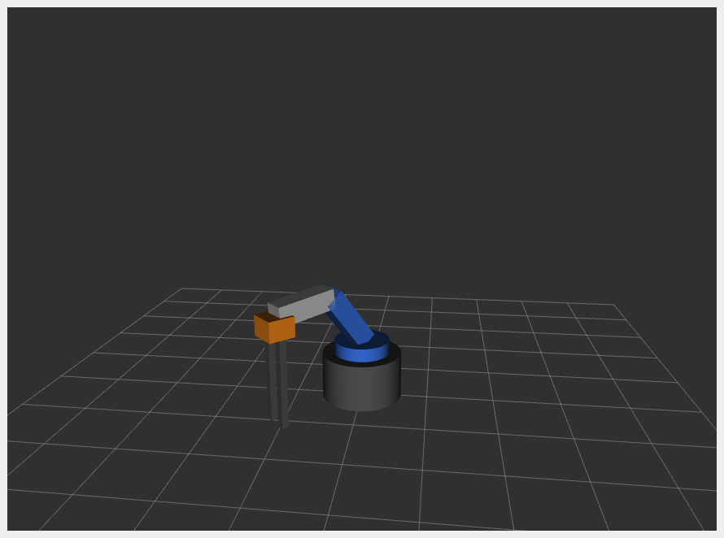
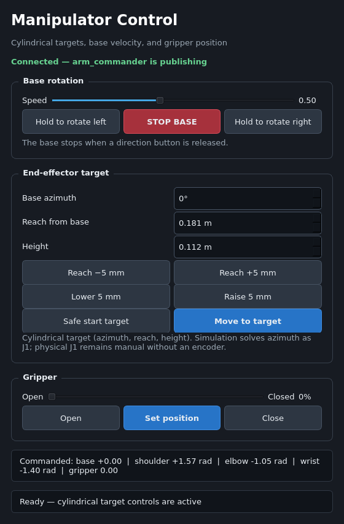
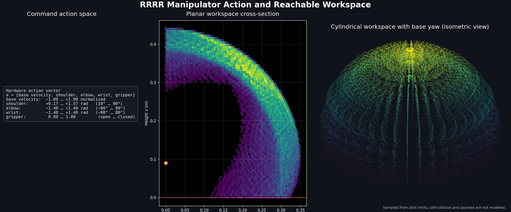

# manipulator_ws

ROS 2 Humble workspace for a 4-DOF RRRR desktop manipulator controlled via an ESP32 (micro-ROS).

## Robot overview

| Joint | Type | Axis | Range | Hardware |
|---|---|---|---|---|
| J1 — base yaw | Continuous | Z | velocity-only (no position limit) | 360° servo |
| J2 — shoulder | Revolute | Y | ±90° | Standard servo |
| J3 — elbow | Revolute | Y | ±90° | Standard servo |
| J4 — wrist | Revolute | Y | ±90° | MG90S servo |
| Gripper | Prismatic (×2) | Y | 0–13 mm | Servo |

**Link geometry** (matches `arm_ik_2d.py`):

```
Shoulder origin:  0.09 m above ground  (base 0.07 m + turntable 0.02 m)
L1  shoulder → elbow:  0.10 m
L2  elbow → wrist:     0.09 m
L3  wrist → EE tip:    0.16 m  (gripper_base 0.03 m + fingers 0.13 m)
```

## Screenshots

| RViz simulation — 45° base yaw | Qt hardware control panel |
|:---:|:---:|
|  |  |

## Packages

| Package | Type | Purpose |
|---|---|---|
| `manipulator_description` | ament_cmake | URDF/xacro, RViz config |
| `manipulator_control` | ament_python | Keyboard teleop, click-to-target, arm commander, 2D IK |
| `manipulator_kinematics` | ament_python | 3D IK node with TF-based trajectory visualization |

## Prerequisites

- **ROS 2 Humble**
- **setuptools 58.2.0** — required for colcon to build `ament_python` packages (newer versions dropped `setup.py develop --editable`):

```bash
pip3 install setuptools==58.2.0
```

- Standard ROS tools (already in a desktop install):

```bash
sudo apt install ros-humble-joint-state-publisher-gui \
                 ros-humble-robot-state-publisher \
                 ros-humble-rviz2 \
                 ros-humble-xacro \
                 ros-humble-tf2-ros \
                 ros-humble-joy \
                 python3-pyqt5
```

`ros-humble-joy` is only needed if you are using a gamepad.
`python3-matplotlib` and `python3-numpy` are optional dependencies for
regenerating the workspace plot.

## Build

```bash
cd ~/manipulator_ws
source /opt/ros/humble/setup.bash
colcon build --symlink-install
source install/setup.bash
```

Add the source line to your shell if you don't want to run it each session:

```bash
echo "source ~/manipulator_ws/install/setup.bash" >> ~/.bashrc
```

## Usage modes

### 1. Visualize only (joint sliders)

Shows the robot in RViz with a GUI slider for every joint. Useful for checking the model.

```bash
source /opt/ros/humble/setup.bash
source install/setup.bash
ros2 launch manipulator_description display.launch.py
```

### 2. Keyboard teleop

Opens RViz and lets you drive each joint from the keyboard. Run the launch file in one terminal and the teleop node in a second terminal (it requires raw key input on its own TTY).

**Terminal 1:**
```bash
ros2 launch manipulator_control teleop.launch.py
```

**Terminal 2:**
```bash
ros2 run manipulator_control keyboard_teleop
```

Key bindings:

| Key | Action |
|---|---|
| `q` / `a` | base spin left / right (velocity, keeps spinning) |
| `space` | base stop |
| `w` / `s` | J2 shoulder +/− |
| `e` / `d` | J3 elbow +/− |
| `r` / `f` | J4 wrist +/− |
| `t` / `g` | gripper close / open |
| `z` | home (all joints to 0, base stops) |
| `x` | quit |

J1 is velocity-controlled: press `q` or `a` to start spinning, `space` to stop. J2–J4 step 0.05 rad (~3°) per keypress; gripper steps 2 mm.

### 3. Click-to-move (IK)

Click anywhere in the RViz viewport to send the arm to that position using the IK solver. The EE trajectory is drawn as an orange line.

```bash
ros2 launch manipulator_control click_move.launch.py
```

In RViz, select the **Publish Point** tool from the top toolbar, then click on the ground grid. The IK node smoothly interpolates the arm to the target over ~1.5 s and reports the final position error in the terminal.

### 4. Base + gripper teleop (separate node)

Velocity control for the continuous-rotation base servo and direct gripper control:

```bash
ros2 run manipulator_control base_gripper_teleop
```

| Key | Action |
|---|---|
| `j` | base rotate left |
| `l` | base rotate right |
| `k` | base stop |
| `o` | gripper open |
| `p` | gripper close |
| `x` | quit |

### 5. Real hardware (joystick + click-to-target)

See [Hardware control](#hardware-control) below.

### 6. Qt hardware control panel

The Qt panel controls base rotation, cylindrical target coordinates
(azimuth/reach/height), and the positional gripper through `arm_commander`:

```bash
ros2 launch manipulator_control control_gui.launch.py
```

For the full hardware stack (RViz, click-to-target, commander, and the Qt
panel), run:

```bash
ros2 launch manipulator_control hardware.launch.py
```

Hold a base direction button to rotate; releasing it sends a stop command.
The reach/height jog buttons move in 5 mm steps, and invalid targets are
rejected in the panel. The status line turns green when `/arm_command`
feedback is being received from `arm_commander`.

### 7. Closed-loop PID numerical simulation

Runs the same Qt panel and `/arm_command` interface as deployment, but replaces
the ESP32/servos with a 200 Hz numerical plant. J2-J4 use position PID with
gravity feedforward; J1 uses velocity PID; the gripper uses position PID.
`/joint_states` contains simulated encoder measurements, not copied commands:

```bash
ros2 launch manipulator_control pid_sim.launch.py
```

Desired state is published on `/joint_setpoint`. `/pid_diagnostics` contains
five errors followed by five controller efforts. Publish five additive efforts
to `/sim_disturbance` to test rejection, then publish zeros to remove them:

```bash
ros2 topic pub -1 /sim_disturbance std_msgs/msg/Float32MultiArray \
  "{data: [0.0, 0.25, 0.0, 0.0, 0.0]}"
ros2 topic pub -1 /sim_disturbance std_msgs/msg/Float32MultiArray \
  "{data: [0.0, 0.0, 0.0, 0.0, 0.0]}"
```

The inertia, damping, and PID gains in `pid_sim_node.py` are nominal simulation
parameters. Identify the real plant after installing encoders before reusing
those gains on hardware.

## ROS topics

| Topic | Type | Publisher | Subscriber |
|---|---|---|---|
| `/joint_states` | `sensor_msgs/JointState` | `keyboard_teleop`, `ik_node`, or `pid_sim` | `robot_state_publisher` |
| `/joint_setpoint` | `sensor_msgs/JointState` | `pid_sim` | diagnostics/plots |
| `/target_pose` | `geometry_msgs/Point` | `click_to_target`, `joy_to_arm`, `arm_control_gui` | `ik_node`, `arm_commander` |
| `/base_cmd` | `std_msgs/Float32` | `joy_to_arm`, `arm_control_gui`, `base_vel_gui`, `base_gripper_teleop`, `keyboard_teleop` | `arm_commander`, `ik_node` |
| `/gripper_cmd` | `std_msgs/Float32` | `joy_to_arm`, `arm_control_gui`, `base_gripper_teleop` | `arm_commander`, `ik_node` |
| `/joy` | `sensor_msgs/Joy` | `joy_node` | `joy_to_arm` |
| `/arm_command` | `std_msgs/Float32MultiArray` | `arm_commander` | ESP32 (micro-ROS), `pid_sim` |
| `/pid_diagnostics` | `std_msgs/Float32MultiArray` | `pid_sim` | diagnostics/plots |
| `/sim_disturbance` | `std_msgs/Float32MultiArray` | test/operator | `pid_sim` |
| `/clicked_point` | `geometry_msgs/PointStamped` | RViz | `click_to_target` |
| `/click_marker` | `visualization_msgs/Marker` | `click_to_target` | RViz |
| `/ee_trajectory` | `visualization_msgs/Marker` | `ik_node` | RViz |

### `/arm_command` payload

Five floats sent to the ESP32 at 50 Hz:

```
[0]  base_velocity   -1.0 .. +1.0
[1]  shoulder_angle  rad
[2]  elbow_angle     rad
[3]  wrist_angle     rad
[4]  gripper         0.0 open .. 1.0 closed
```

The base joint uses velocity (not position) because the hardware is a continuous-rotation servo with no angle feedback.

### Action space and workspace

The physical command action is:

| Index | Action | Range |
|---:|---|---|
| 0 | Base velocity | −1.0 to +1.0 normalized |
| 1 | Shoulder angle | +0.175 to +1.571 rad (10° to 90°) |
| 2 | Elbow angle | −1.396 to +1.396 rad (−80° to 80°) |
| 3 | Wrist angle | −1.396 to +1.396 rad (−80° to 80°) |
| 4 | Gripper position | 0.0 open to 1.0 closed |

`arm_commander` prints these ranges at startup. The plot below samples the
joint limits, filters out points below ground, and revolves the planar set
through the continuous base yaw. It does not model self-collision or payload.



Regenerate the plot with:

```bash
python3 src/manipulator_control/scripts/plot_action_space.py
```

## IK solvers

Two independent IK implementations are included:

**`arm_ik_2d.py`** (used by `arm_commander`) — cylindrical decomposition plus
2D geometric IK in the vertical arm plane. It converts a Cartesian target with
`yaw = atan2(y, x)` and `reach = sqrt(x² + y²)`, then solves shoulder, elbow,
and wrist. It prefers the EE pointing straight down and searches other
orientations in 1° steps when necessary.

**`ik_node.py`** (used by `click_move.launch.py`) — full cylindrical IK for the
simulation. It commands J1 to the solved yaw, interpolates all four joints over
50 steps, and reads the EE position from TF for trajectory drawing.

#### Why hardware base yaw remains manual

The cylindrical solver returns an absolute base yaw, and the URDF simulation
uses it directly. The physical J1 is a 360° continuous-rotation servo: it only
accepts speed and has no encoder, so the software cannot know its current angle
or close the loop on a desired yaw. The Qt azimuth field is therefore a target
reference for hardware while the operator aligns J1 with the hold buttons.

For true four-joint hardware IK, replace J1 with a positional servo or add an
absolute encoder. Then `/arm_command[0]` can carry base yaw instead of velocity
and the firmware can close the position loop.

## Hardware control

The gamepad connects to the **PC** (USB or Bluetooth), not to the ESP32. The ESP32 only runs a lightweight micro-ROS subscriber and drives the servos.

```
Gamepad ──(USB/BT)──▶ PC
                       ├─ joy_node      → /joy
                       ├─ joy_to_arm    → /base_cmd, /target_pose, /gripper_cmd
                       ├─ arm_control_gui → /base_cmd, /target_pose, /gripper_cmd
                       └─ arm_commander → /arm_command ──(WiFi)──▶ ESP32 servos
```

Arduino libraries required: **ESP32Servo**, **micro_ros_arduino** (Humble branch).

---

### One-time firmware setup

**1. Fill in your network details** at the top of `esp32_microros.ino`:

```cpp
#define WIFI_SSID   "your-network"
#define WIFI_PASS   "your-password"
#define AGENT_IP    "192.168.x.x"   // run: hostname -I | awk '{print $1}'
#define AGENT_PORT  8888
```

**2. Flash** via Arduino IDE (board: *ESP32 Dev Module*, partition scheme: *Huge APP (3MB No OTA)*, upload speed: 921600).

**3. Verify servo zero positions** — at startup all servos receive 1500 µs (center pulse). The arm should sit with each link pointing **horizontal** (shoulder/elbow/wrist all at 0 rad in `arm_ik_2d` convention). If a link points the wrong way, rotate the servo horn one spline and reflash.

---

### Every session

**Terminal 1 — micro-ROS agent** (keep running):

```bash
docker run -it --rm --net=host microros/micro-ros-agent:humble udp4 --port 8888
```

Wait for `[1] [RTPS Participant matched]` — confirms the ESP32 connected.

**Terminal 2 — joystick driver:**

```bash
ros2 run joy joy_node
```

Plug in or pair your gamepad before running this. Verify it works with `ros2 topic echo /joy`.

**Terminal 3 — joy_to_arm translator:**

```bash
source ~/manipulator_ws/install/setup.bash
ros2 run manipulator_control joy_to_arm
```

**Terminal 4 — arm_commander** (IK + hardware bridge):

```bash
ros2 run manipulator_control arm_commander
```

> For RViz click-to-target and the base velocity GUI as well, replace terminals 3 and 4 with:
> ```bash
> ros2 launch manipulator_control hardware.launch.py
> ```
> Then run `joy_to_arm` in a fifth terminal.

---

### Gamepad button mapping

| Input | Action |
|---|---|
| **L1** | Base rotate left |
| **R1** | Base rotate right |
| **D-pad ↑ / ↓** | EE height +/− 5 mm |
| **D-pad → / ←** | EE reach +/− 5 mm |
| **△ / Y** | Gripper open |
| **□ / X** | Gripper close |

Default indices are set for **PS3/PS4 on Linux**. If your controller maps differently, run `ros2 topic echo /joy` while pressing buttons to find the right indices, then edit the constants at the top of [joy_to_arm.py](src/manipulator_control/manipulator_control/joy_to_arm.py).

**Reachable workspace** (ground-level targets, with wrist orientation allowed
to tilt when straight-down is unavailable):

```
approximately 0.120 m ≤ reach from base axis ≤ 0.324 m
```

The UI input bounds are intentionally broader; the IK solver validates every
reach/height pair and rejects targets outside the actual joint-limited region.

---

### Failsafe behaviour

| Condition | Response |
|---|---|
| `/arm_command` silent for > 1 s | Base servo stops; position servos hold last angle |
| micro-ROS agent unreachable for > 5 s | ESP32 reboots and reconnects automatically |

> **Note:** RViz shows the URDF at its home pose and does not mirror the real arm. `arm_commander` does not publish `/joint_states`.

---

### Calibration

**Joystick feel** — edit constants at the top of [joy_to_arm.py](src/manipulator_control/manipulator_control/joy_to_arm.py):

| Constant | Default | Adjust when… |
|---|---|---|
| `STEP` | 0.005 m | D-pad steps feel too coarse or too fine |
| `BASE_SPEED` | 0.5 rad/s | Base rotates too fast or too slow |

**Servo tuning** — edit constants at the top of `esp32_microros.ino`:

| Constant | Default | Adjust when… |
|---|---|---|
| `BASE_SPEED_RANGE` | 200 µs | Base doesn't reach the speed set by `BASE_SPEED` |
| `GRIP_OPEN_DEG` | 80° | Gripper does not open to the desired position |
| `GRIP_CLOSED_DEG` | 140° | Gripper does not close to the desired position |
| `SERVO_MIN_US` / `SERVO_MAX_US` | 500 / 2500 µs | Positional servo travel is compressed or reaches its mechanical stop |
